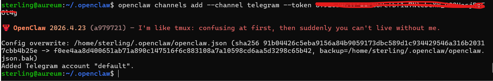
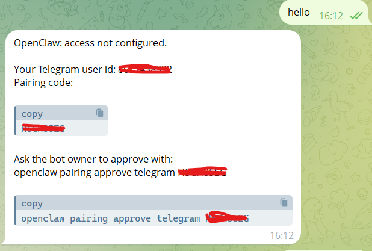
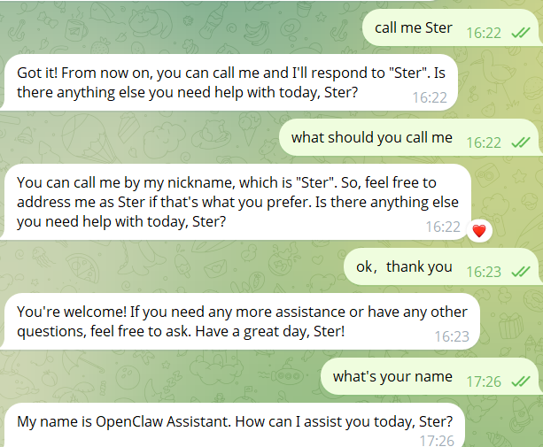

# Telegram Channel Baseline

## Purpose

This document records the first external channel baseline for the OpenClaw Deployment Lab.

The goal of this phase is to:

- add one real chat channel to OpenClaw
- validate the Telegram inbound and outbound message path
- verify the initial pairing flow
- confirm basic short-session continuity in Telegram DM

This is a baseline integration only and focuses on a single Telegram bot in direct-message mode.

---

## Environment

Lab environment used in this baseline:

- OpenClaw: 2026.4.23
- gateway mode: local
- model backend: remote vLLM
- model used: qwen25-14b-awq
- tested channel: Telegram
- session scope: per-channel-peer DM

---

## Prerequisites

Confirm that channel commands are available:

```bash
openclaw channels -h
```

Optional pre-checks:

```bash
openclaw channels list
openclaw channels status --deep
```

---

## Create Telegram bot

Create a Telegram bot with BotFather:

1. Open Telegram
2. Search for `@BotFather`
3. Run `/start`
4. Run `/newbot`
5. Set a bot display name
6. Set a bot username ending with `bot`
7. Copy the generated bot token

Verify the token:

```bash
curl "https://api.telegram.org/bot<TELEGRAM_BOT_TOKEN>/getMe"
```

---

## Add Telegram channel to OpenClaw

Add the Telegram account:

```bash
openclaw channels add --channel telegram --token "<TELEGRAM_BOT_TOKEN>"
```

Expected result:

- OpenClaw updates the local config
- a Telegram account named `default` is added

Useful checks:

```bash
openclaw channels list
openclaw channels status --deep
openclaw channels logs
```



---

## Pair the first Telegram user

After the channel is added, open the bot in Telegram and send a first message:

```text
hello
```

On first contact, OpenClaw does not automatically trust the user. The bot returns:

- an access-not-configured message
- the Telegram user id
- a pairing code
- the approval command for the bot owner

Approve the user with:

```bash
openclaw pairing approve telegram <PAIRING_CODE>
```

After approval, the same Telegram user can start a normal DM conversation.



---

## Validate Telegram DM flow

### 1. Basic connectivity

Example prompts:

```text
hello
what's the date today
```

Expected result:

- the bot replies normally
- the Telegram -> OpenClaw -> model path works end to end

### 2. Short-session continuity

Example prompts:

```text
my name is Sterling
what is my name
summarize our short conversation
```

Expected result:

- the bot preserves short conversational context
- the DM path behaves like a persistent external session

### 3. Naming behavior observation

Additional prompts:

```text
call me Ster
what should you call me
```

Observed behavior in this lab:

- Telegram peer identity appears to influence naming behavior
- the model may use Telegram-side display information in addition to conversation text
- user-provided naming preference can affect later replies
- wording may still be imperfect on smaller models

This is treated as a model behavior detail, not as a channel integration failure.



---

## Result

Telegram was successfully validated as the first external channel in this lab.

Validated items in this phase:

- Telegram bot token works
- Telegram account can be added to OpenClaw
- first-user pairing is enforced
- owner approval enables user access
- Telegram DM messaging works end to end
- short-session continuity is available after pairing

This confirms that the lab now supports a working external chat entry point beyond the local UI.

Future work may cover:

- Telegram group behavior
- multi-user behavior
- additional channel comparison
- tighter channel security controls
